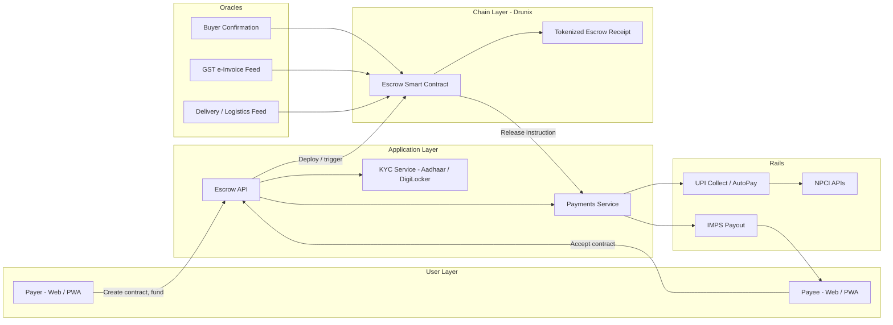

# smart-escrow

**Programmable, milestone-based payments for India's gig and MSME economy.**

Built for the Drunix Hackathon (in collaboration with Citi) — India Blockchain Forum
Track: *Innovative Fintech Ideas* · Challenge Code: CHL-7007

---

## The Problem

Gig workers and MSMEs in India move money instantly over UPI, but UPI has no concept
of *conditions*. A freelancer delivering work in stages, or a supplier shipping goods
against milestones, has no trustworthy way to tie payment release to actual delivery.
The result: payment disputes, delayed cash flow, and reliance on slow, expensive,
bank-mediated escrow that doesn't work for small, high-frequency transactions.

## The Solution

SmartEscrow is a blockchain-based escrow layer on top of UPI. A payer locks funds
against a smart contract with defined milestones. Funds sit in a regulated pooled
account, represented on-chain as a tokenized escrow receipt. Release happens
automatically when a milestone is verified — by buyer confirmation or an oracle-fed
signal (delivery, GST e-invoice, logistics status) — with a tamper-proof on-chain
audit trail for any dispute.

## Architecture



## How It Works

1. **Onboard** — Payer and payee sign in with existing UPI ID; KYC via Aadhaar/DigiLocker.
2. **Create contract** — Payer defines amount and milestones; funds are pulled via UPI into a pooled escrow account.
3. **Mint receipt** — A smart contract on Drunix mints a non-transferable token representing the locked funds and conditions.
4. **Verify milestone** — Completion is confirmed via buyer sign-off or an oracle (delivery API, GST invoice, logistics tracking).
5. **Release funds** — The contract triggers payout via UPI/IMPS, instantly and automatically.
6. **Dispute path** — Unresolved disputes freeze the remaining balance; the full on-chain history is used as evidence in arbitration.

## Tech Stack

| Layer | Technology |
|---|---|
| Blockchain | Drunix platform — smart contracts for escrow logic & token receipts |
| Payments | UPI (Collect/AutoPay), NPCI APIs, IMPS settlement |
| Identity | Aadhaar e-KYC, DigiLocker |
| Backend | Node.js / Python microservices, PostgreSQL |
| Oracles | Custom middleware for delivery, logistics, and GST e-invoice data |
| Frontend | React (mobile-first PWA) |
| Security | HSM-backed key management, encrypted PII storage, full audit logging |

## Repository Structure

```
smart-escrow/
├── backend/
│   └── src/
│       ├── contracts/     # Drunix smart contracts (escrow logic, token receipt)
│       ├── api/
│       │   ├── escrow/    # Contract creation, milestone, release endpoints
│       │   ├── payments/  # UPI/IMPS integration
│       │   └── kyc/       # Aadhaar / DigiLocker onboarding
│       ├── oracles/       # Delivery, logistics, GST e-invoice feeds
│       └── services/      # Shared business logic
├── frontend/
│   └── src/
│       ├── components/    # UI components
│       └── pages/         # App screens
├── docs/                  # Architecture notes, API specs, diagrams
└── scripts/               # Setup and deployment scripts
```

## Getting Started

```bash
# Backend
cd backend && npm install && npm run dev

# Frontend
cd frontend && npm install && npm start
```

Environment variables (see `.env.example` in each service): NPCI/UPI sandbox
credentials, Drunix testnet RPC endpoint, Aadhaar e-KYC sandbox keys.

## Roadmap

- [x] Problem validation & solution design
- [ ] Escrow smart contract (testnet)
- [ ] UPI Collect/AutoPay integration (sandbox)
- [ ] Milestone oracle middleware (delivery + GST e-invoice)
- [ ] Web app (payer/payee flows)
- [ ] Dispute/arbitration flow
- [ ] Pilot with a gig marketplace / MSME trade group

## Team

_Add team member names, roles, and contact here._

## License

MIT — see `LICENSE`.

